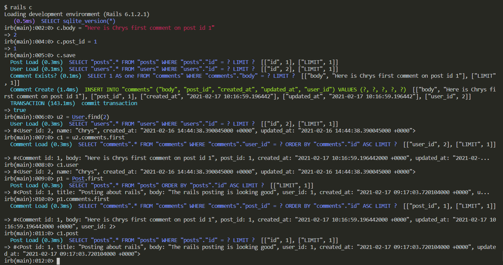

# ACTIVE RECORD PROJECT - Micro-reddit
## This project is a kind of mini Reddit where users Post ideas and have discussions

## Built With

- Ruby
- Rubocop
- Visual Studio Code
- Rspec

### Ruby version

  ``` ruby 2.7.2 ```

### System dependencies

  ``` rails 6.1.7 ```
  ``` yarn 1.2.2 ```
  ``` node 14.15.5 ```

### Configuration

  Set up project using the above specifications
   #### For HTTPS
   - use ``` git clone https://github.com/Ralph-1/Micro-reddit.git ``` to clone the repository
   #### For SSH
   - use ``` git clone git@github.com:Ralph-1/Micro-reddit.git ``` to clone the repository
   - Change to the parent directory of the project using 
    ``` cd micro-reddit ```
   - run ```bundle install ``` to install dependencies
   - use ``` rails c ``` to go to the console
   - use ``` rails s ``` to run the rails server

## Authors

👤 **Ralph Oburu**

- GitHub: [@ralph-1](https://github.com/Ralph-1)
- Twitter: [@notralph0](https://twitter.com/NotRalph0)
- LinkedIn: [Ralph Oburu](https://www.linkedin.com/in/ralph-oburu-092a561b1/)

👤 **Malieze Afam Ifeanyi**

- GitHub: [@chrystalme](https://github.com/chrystalme)
- Twitter: [@afam_ifeanyi](https://twitter.com/afam_ifeanyi)
- LinkedIn: [Malieze Afam Ifeanyi(chrys)](https://linkedin.com/afam-chrys)

## 🤝 Contributing

Contributions, issues, and feature requests are welcome!

Feel free to check the [issues page](https://github.com/Ralph-1/Micro-reddit/issues).

## Show your support

Give a ⭐️ if you like this project!

## Acknowledgments

- [Odin Projects](https://www.theodinproject.com/) and 
- [Microverse](https://microverse.com)
- etc

## 📝 License

This project is [MIT](https://mit-license.org/) licensed.
